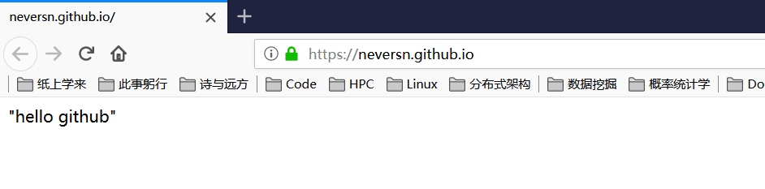
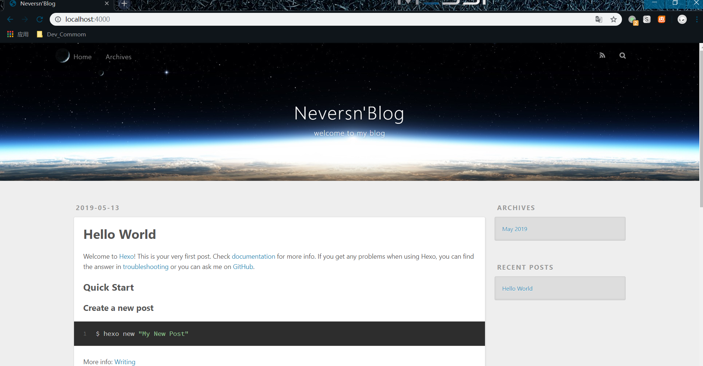
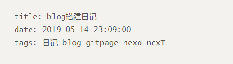
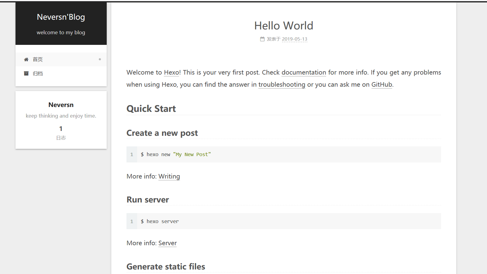
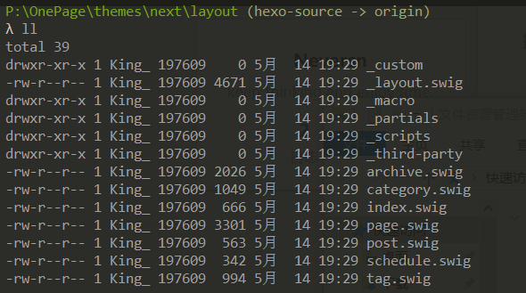
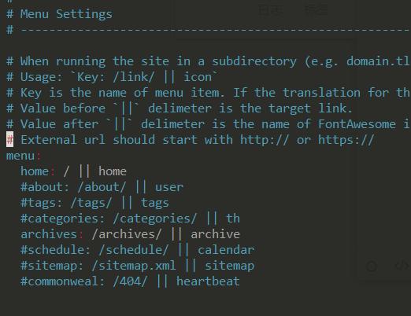
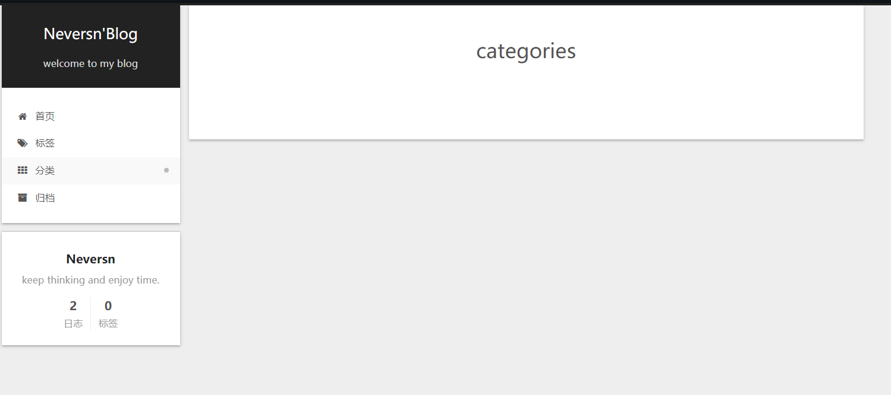
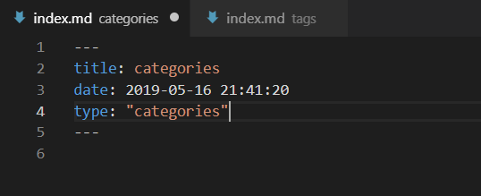

# blog搭建日记


##  Day 1

### gitpage 初步尝试

参考： [gitpage官方介绍][1]

个人理解，gitpage应该是github 提供的静态网页托管服务，他和git仓库的某个分支绑定，自动部署。

- 创建username.github.io 为名的仓库

- 向master分支提交任意内容，此时，gitpage自动绑定好了，通过usename.github.io即可访问，访问效果如下：

  

#### notice

- 关于gh-pages分支。个人主页只能绑定master分支，项目主页才可绑定在gh-pages分支上。[Github page shows master branch, not gh-pages][5]

### hexo 

> Hexo 是一个快速、简洁且高效的博客框架。Hexo 使用 [Markdown](http://daringfireball.net/projects/markdown/)（或其他渲染引擎）解析文章，在几秒内，即可利用靓丽的主题生成静态网页。

[中文社区][2]

#### notice:

- 需要执行hexo deploy 前， 需要配置_config.yml 中的deploy项。


### 成果

按着教程按部就班，使得[个人主页][3]可以访问了。



## Day 2

### 更换主题：nexT

[NexT User Docs – Starting to Use][4]

- 更改language:  后， 重启生效

### 新建post（博文）

```sh
hexo new post title
```

本质上是在hexo/source/_post/ 目录下创建了一个 *.md 文件， 文件中包含scaffolds中模板信息，如下，在此基础上继续编辑即可：




- 引用文件通过相对目录引用
- [hexo博客添加图片][6] : 通过使用 hexo-asset-image插件实现mardowm文章内图片链接在生成静态页面时的映射

### 成果


### 遗留问题

- 无法访问图片

## Day 3

### 博客中图片无法显示问题

- 原因：生成静态页面目录与实际文件目录不一致。

  图片访问地址为： 

  ```js
  src="/2019/05/14/build_blog_diary/**2019-05-14-build_blog_diary**/1557755944810.png"
  ```

  实际目录中文件路径为：

  ```sh
   public\2019\05\14\build_blog_diary\1557755944810.png
  ```

- 解决

  引用时直接引用文件名，省略标题同名目录。

  如文章名叫 title , 图片A 在 ./title/A.png， 此时应用时因输入 \!\[A desc\]\(A.png\) 而不是 \!\[./title/A desc\]\(A.png\)

### 遗留问题

- 上述问题解决后，本地编辑器无法很好地预览图片。

## Day 4

### hexo-asset-image 插件 本地 静态页面 插画图片统一问题

- 分析Day 3遗留问题，查看最新[hexo-asset-image插件源码](https://github.com/xcodebuild/hexo-asset-image/blob/master/index.js):

  ```javascript
  ....
  			  var srcArray = src.split('/').filter(function(elem){
  				return elem != '' && elem != '.';
  			  });
  			  if(srcArray.length > 1)
  				srcArray.shift();
  			  src = srcArray.join('/');
  			  $(this).attr('src', config.root + link + src);
  ....
  ```

  发现，插件将原文章中图片引用链接移除了第一个/ 及之前的内容。故相对路径引用**不应**使用 \[\]\(./title/A.png\) 而**应该**使用  \[\]\(tiltle/A.png\)

- 直接安装的hexo-asset-image插件不对，使用github上[xcodebuild](https://github.com/xcodebuild)的。

  ```sh
  npm uninstall hexo-asset-image
  npm install https://github.com/xcodebuild/hexo-asset-image --save
  ```

### 增加标签页和分类页

[详细教程](http://theme-next.iissnan.com/theme-settings.html)

1. 查看hexo/theme/next/layout 目录内容,可以看到，其已经内置多种页面布局：

   

2. 新建分类页标签页

   1. 执行以下命令后, source 目录下就会多source/categories/
      source/tags/两个目录，但此时页面菜单中上未多出新的选项

      ```sh
      hexo new page tags
      hexo new page categories
      ```

   2. 将 hexo_root/theme/next/_config.yml 中menu选项对应注释去除，注释去除后，刚建立的页面显示出来了,但此时，标签页和分类页中啥都没有。

      

      

   3. 编辑hexo_root/source/categories/index.md 和 hexo_root/source/tags/index.md，加上type描述，此时标签页和分类页生效。

      

   4. 以后的所有md文章，在文件开头加上Front-matter即可正确分类和打标签。[Front-matter格式说明](https://hexo.io/zh-cn/docs/front-matter.html#%E5%88%86%E7%B1%BB%E5%92%8C%E6%A0%87%E7%AD%BE)

### notice

- 注意引用文件后缀大小写，Typora中大小写不敏感，静态页面中大小写敏感

----

***参考资料***

[1]:https://pages.github.com/
[2]: https://hexo.io/zh-cn/docs/
[3]:  https://neversn.github.io/
[4]:https://theme-next.org/docs/getting-started/

[5]: https://stackoverflow.com/questions/25559292/github-page-shows-master-branch-not-gh-pages
[6]:https://www.jianshu.com/p/cf0628478a4e


---
