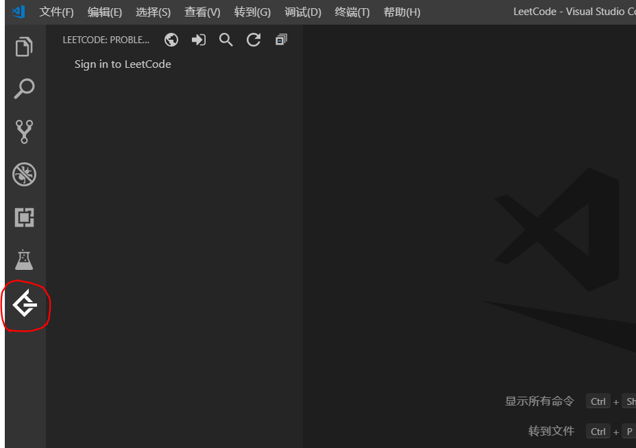
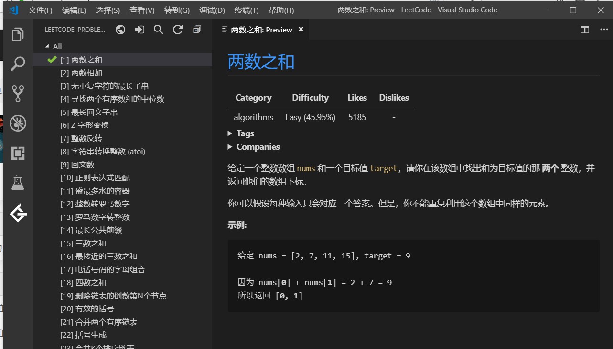
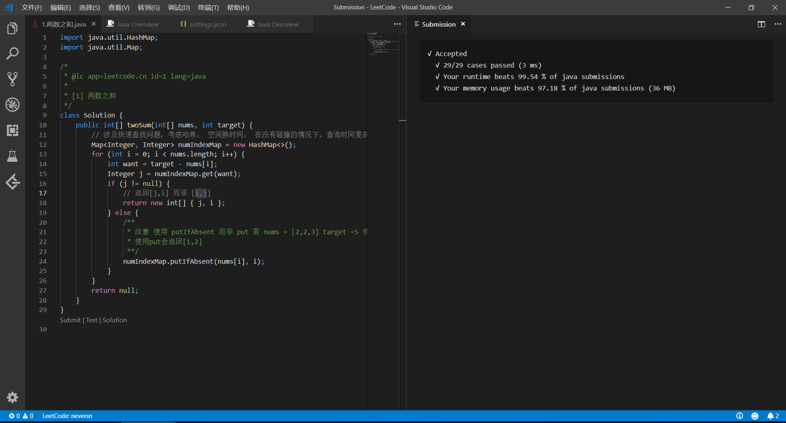

# leetcode 环境准备

目标：使用vscode 进行leecode编码训练

## 安装 java 插件

[官方java-tutorial](https://code.visualstudio.com/docs/java/java-tutorial)

> To help set up Java on VS Code, there is the Microsoft [Java Extension Pack](https://marketplace.visualstudio.com/items?itemName=vscjava.vscode-java-pack), which contains these popular extensions:
>
> 1. [Language Support for Java(TM) by Red Hat](https://marketplace.visualstudio.com/items?itemName=redhat.java)
> 2. [Debugger for Java](https://marketplace.visualstudio.com/items?itemName=vscjava.vscode-java-debug)
> 3. [Java Test Runner](https://marketplace.visualstudio.com/items?itemName=vscjava.vscode-java-test)
> 4. [Maven for Java](https://marketplace.visualstudio.com/items?itemName=vscjava.vscode-maven)
> 5. [Java Dependency Viewer](https://marketplace.visualstudio.com/items?itemName=vscjava.vscode-java-dependency)

## LeetCode 插件

[vscode-leetcode介绍](https://github.com/jdneo/vscode-leetcode/blob/master/docs/README_zh-CN.md)

安装插件后，侧边栏出现LeetCode图标,登陆后即可做题。

​	

## 使用效果

